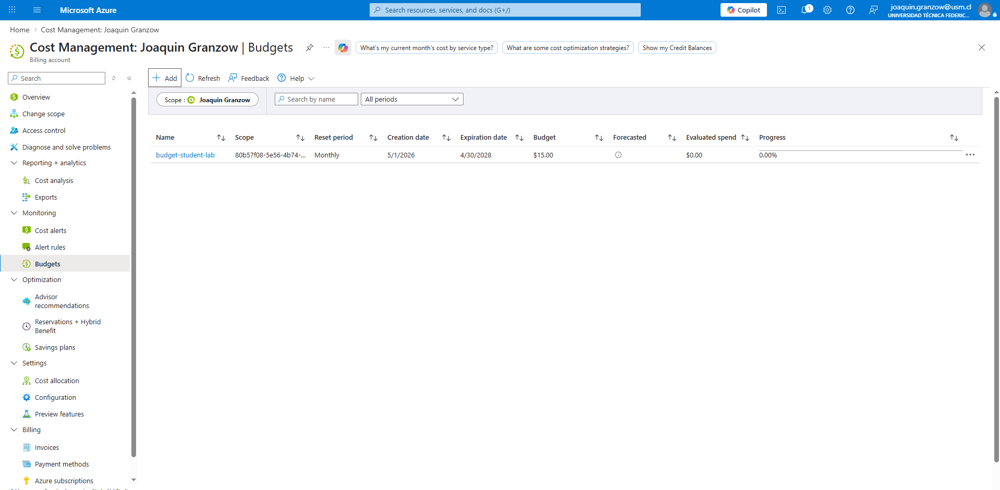
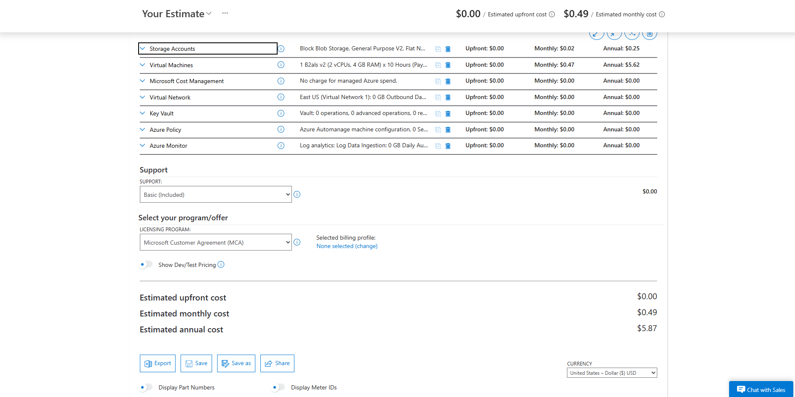

# Progress

## Day 1 — May 29, 2026

**Phase:** Phase 1

**What I did:**
- Created the naming convention
- Defined security objectives
- Estimated the monthly and annual cost with pricing calculator
- Created a budget of $15 with alerts at 50%, 80%, and 100%

**Security decisions made:**
- None

**Key takeaway of the day:**

> Today is the first day, so I did a little of preparation. I updated the planning with the naming convention, security objectives, and estimated the monthly cost with Azure Pricing Calculator. Pretty good first day in my opinion; I am applying what I learned from AZ-900.

**Evidence:**
- 
- 